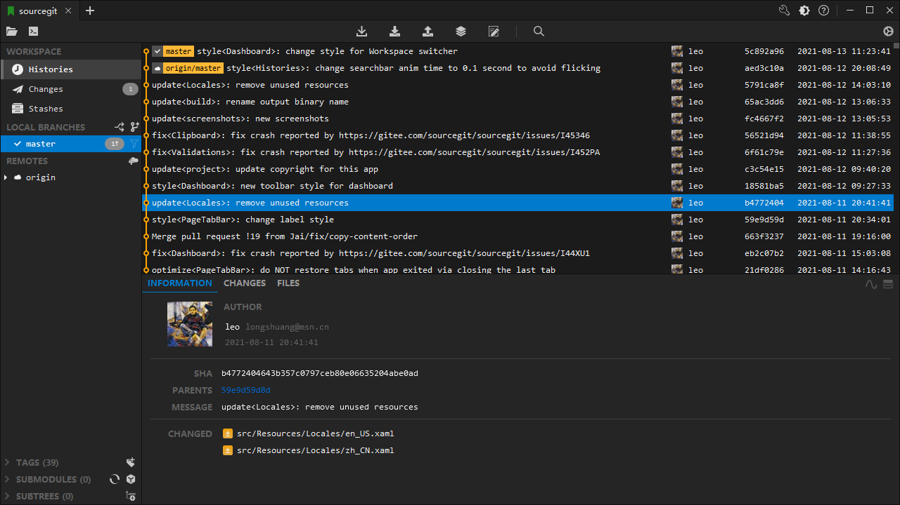
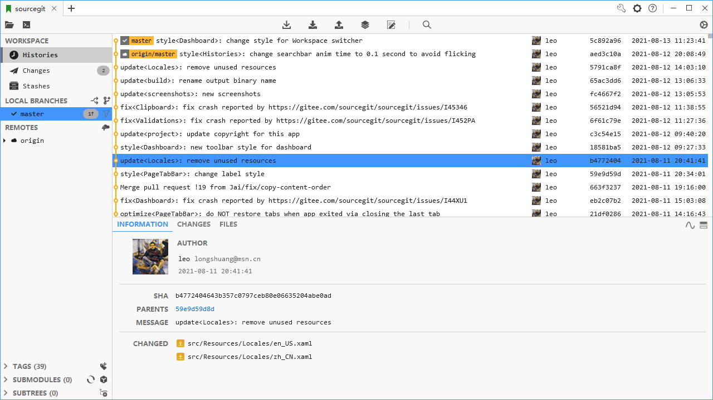

SrcGit - 一个 Windows 平台上的 GIT GUI 客户端

##
&emsp;&emsp;SrcGit 是一个 Windows 平台上的 GIT GUI 客户端。SrcGit 实际上是个 shell，本身并不包含 GIT。因此，要使用 SrcGit 必须自行安装 GIT，下载地址：https://git-scm.com/。

> 1. SrcGit 是 SourceGit 复刻修改版。由于某些特性没有包含在 SourceGit 中，且我又需要这些特性，因此，复刻修改为 SrcGit。
> 2. SourceGit 原始仓库：https://github.com/sourcegit-scm/sourcegit

## High-lights

* Opensource/Free
* Light-weight
* Fast
* English/简体中文
* Build-in light/dark themes
* Visual commit graph
* Supports SSH access with each remote
* GIT commands with GUI
  * Clone/Fetch/Pull/Push...
  * Branches
  * Remotes
  * Tags
  * Stashes
  * Submodules
  * Subtrees
  * Archive
  * Patch/apply
  * File histories
  * Blame
  * Revision Diffs

## Download

Pre-build Binaries：[Releases](https://github.com/SrcGit-scm/SrcGit/releases)

| File                     | .NET runtime       | Description                       |
| ------------------------ | ------------------ | --------------------------------- |
| SrcGit.exe            | .NET 6 x64         | Need to be installed by user.     |
| SrcGit.bundle.exe     | Self-contained     | -                                 |

> NOTE: You need install Git first.

## Screen Shots

* Drak Theme

* Light Theme

## Thanks

* [XiaoLinger](https://gitee.com/LingerNN) Hotkey: `CTRL + Enter` to commit
* [carterl](https://gitee.com/carterl) Supports Windows Terminal; Rewrite way to find git executable
* [PUMA](https://gitee.com/whgfu) Configure for default user
* [Rwing](https://gitee.com/rwing) GitFlow: add an option to keep branch after finish
* [XiaoLinger](https://gitee.com/LingerNN) Fix localizations in popup panel
